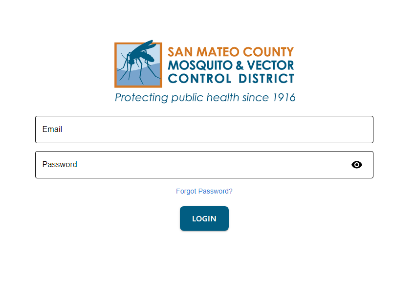
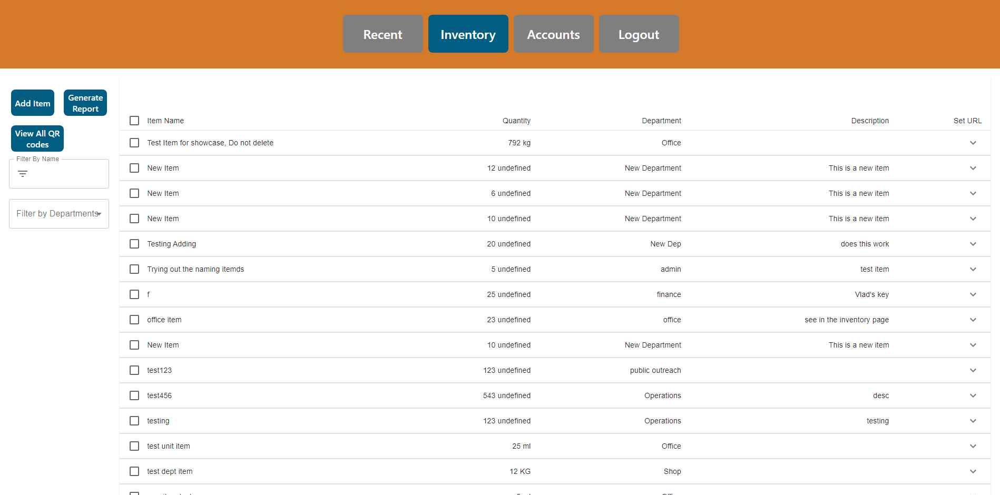
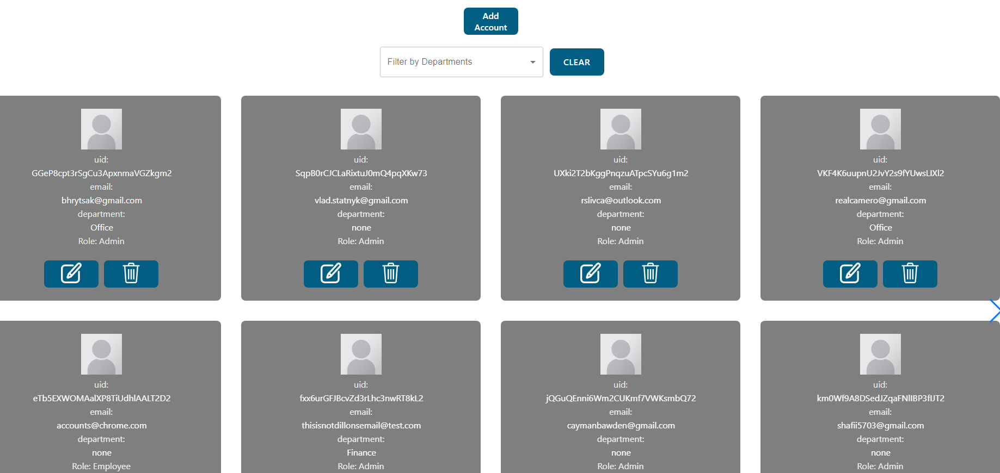
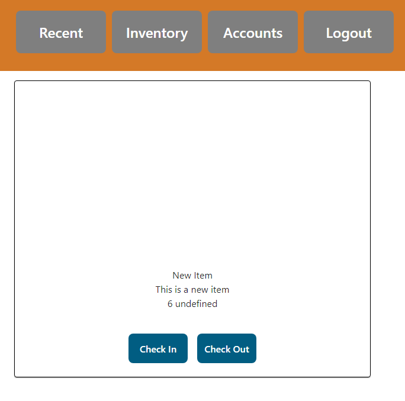

# Inventory tracking app

## Project Description

This inventory tracking application replaces manual, paper-based inventory management with a digital solution tailored for the San Mateo County Mosquito and Vector Control District. By utilizing electronic tracking and QR code scanning, the app streamlines inventory management, enhancing operational efficiency and reducing workload.


## Table of Contents

* [Synopsis](#synopsis)
* [Installation](#installation)
* [Testing](#testing)
* [Deployment](#deployment)
* [Project Timeline](#project-timeline)
* [Project Flow Diagram](#project-flow-diagram)
* [Project Screenshots](#project-screenshots)
    * [Login Screen](#login-screen)
    * [Inventory Screen](#inventory-screen)
    * [Recent Transactions Screen](#recent-transactions-screen)
    * [Accounts Screen](#accounts-screen)
    * [Check In/Out Screen](#check-inout-screen)
* [Developer Contact Information](#developer-contact-information)

---

## Synopsis

- Our Client:
  - San Mateo County Mosquito and Vector Control District
- Our Client’s business:
  - The San Mateo County Mosquito and Vector Control District actively reduces vector populations of disease-carrying pests, employing a science-based approach of integrated vector management. In addition, the district is engaged in ongoing research and development initiatives to enhance its capabilities in safeguarding public health
- Our Client’s “problem” to be solved:
  - The client currently manages inventory using a manual paper-based system, leading to increased workload and extended processing times.
- Our proposed solution:

  - Our team will address the client's current manual inventory management system by introducing an innovative website-based solution. This digital platform will significantly enhance efficiency through electronic inventory management and seamless QR scanning for streamlined item checkouts. By transitioning from a paper-based process to a digital one, we aim to reduce workload and processing times, providing the client with a more effective and time-saving solution.
  - Key solutions:

    - Electronic Inventory Management:
    - Transition from manual paper records to a digital platform.
    - Offers a more organized and efficient method for managing inventory.
    - Enhances the overall control and visibility of the client’s inventory assets.
    - QR Scanning Integration:
    - Expedites the checkout process for a quicker and more user-friendly experience.
    - Enables swift access and updates to inventory information.

  - Our team's solution stands out due to its integration of both electronic inventory management and QR scanning capabilities. This dual functionality provides a comprehensive approach to the client's challenge, ensuring not only a more streamlined inventory control system but also a user-friendly method for item transactions. The combination of these features sets our solution apart, offering a unique and effective approach to solving the client's business problem.

---

## Installation

### Prerequisites

- Node.js must be installed on your machine.

### Clone the Repository

```bash
git clone https://github.com/vstatnyk/Inventory-tracking-app-CSC190-191.git
```

### Install Dependencies

**Server:**
```bash
cd server
npm install
```

**Client:**
```bash
cd client
npm install
```

### Run the Application

**Server:**
```bash
cd server
npm run dev
```

**Client:**
```bash
cd client
npm run dev
```

---

## Testing

### System Requirements:

* **Node.js Version:** v20.4.0
* **npm Version:** 9.8.0
* **Jest Version:** 29.7.0

**Note:** These tests were performed in our testing environment on a Windows 10 OS.

### Setup:

1. **Clone the Github repository:**
```bash
git clone https://github.com/vstatnyk/Inventory-tracking-app-CSC190-191.git
```
2. **Navigate to the Target Directory:**
   - For client-side tests, navigate to the `client` directory.
   - For server-side tests, navigate to the `server` directory.
3. **Install Dependencies:**
```bash
npm install
```
4. **Run Tests:**
   - To run all tests:
   ```bash
   npm test
   ```
   - To run tests for a specific file (e.g. Login.test.jsx):
   ```bash
   npm test Login.test.jsx
   ```

---

## Deployment

### Hostinger Setup

1. **Select Hostinger Tier:** Choose the appropriate hosting plan based on your needs (e.g., Premium, Business, Cloud Startup).
2. **Select Service Duration:** Choose the desired length of service (e.g., 1 month, 12 months, 24 months, 48 months).
3. **Create Hostinger Account:** Register a new account or log in if you already have one.
4. **Domain Setup:**
    * **Create a new domain:** Search for and register a new domain name.
    * **Transfer an existing domain:** Transfer your existing domain to Hostinger for easier management. 

### Server Configuration

1. **Install OS on KVM VPS:** Choose an operating system like Ubuntu 22.04 for your virtual private server.
2. **Point DNS to VPS:** Configure your domain's DNS records to point to your VPS IP address. 
3. **SSH into VPS:** Use the provided root username and password to access your VPS via SSH.

### Application Setup

1. **Install Node.js and npm:**
```bash
sudo apt update
sudo apt install nodejs
sudo apt install npm
```
2. **Install PM2:**
```bash
npm install pm2 -g
```
3. **Clone Repository:**
```bash
git clone https://github.com/vstatnyk/Inventory-tracking-app-CSC190-191.git
```
4. **Configure Firebase:**
  - **Client:** Ensure a `config` folder with a `FirebaseConfig.js` file containing your Firebase project credentials exists.
  - **Server:** Ensure a `config` folder with `FirebaseAdminSDKServiceAccountKey.json` and `FirebaseConfig.js` files containing your Firebase project credentials exists. Additionally, ensure a `.env` file with environment variables for the Firebase service account key path and MongoDB URI is present.
5. **(Optional) Install SSL:** Follow this [tutorial](https://certbot.eff.org/instructions?ws=webproduct&os=ubuntufocal) to install an SSL certificate using certbot for secure connections.
6. **Run the Application:**
```bash
cd Inventory-tracking-app-CSC190-191
./StartMe.sh
```

---

## Project Timeline

The Image below shows our Jira timeline for the project as of the end of sprint 4


---

## Project Flow Diagram


---

## Project Screenshots

### Login Screen

 - Users start here to access the app.



### Inventory Screen

 - After logging in, users are directed to the inventory page to manage items, generate reports, and view QR codes.



### Recent Transactions Screen

 - Authenticated users can view the recent transactions of the inventory on this page.


### Accounts Screen

 - Authenticated users can view registered accounts for the app and manage them on this page.

   

### Check In/Out Screen

 - Users can check in or check out items in the inventory by scanning their QR code which takes them to this page.

   

---

## Developer Contact Information

- Cayman Bawden
  - Email: caymanbawden@gmail.com
- Brian Beilby
  - Email: brianbeilby98@gmail.com
- Douglas Camero
  - Email: realcamero@gmail.com
- Bohdan Hrytsak
  - Email: bhrytsak@gmail.com
- Shafii Mohammed
  - Email: shafii5703@gmail.com
- Matthew Ryan
  - Email: mryan5072@gmail.com
- Rafael Slivca
  - Email: rslivca@outlook.com
- Vlad Statnyk
  - Email: vlad.statnyk@gmail.com
