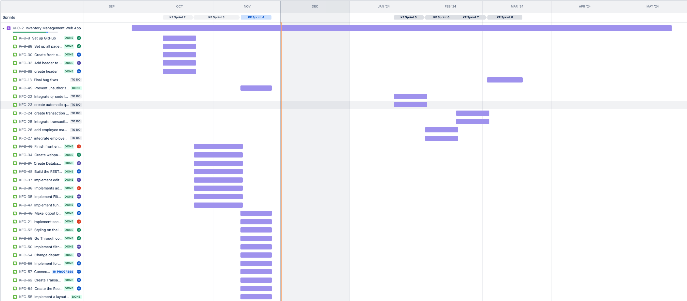
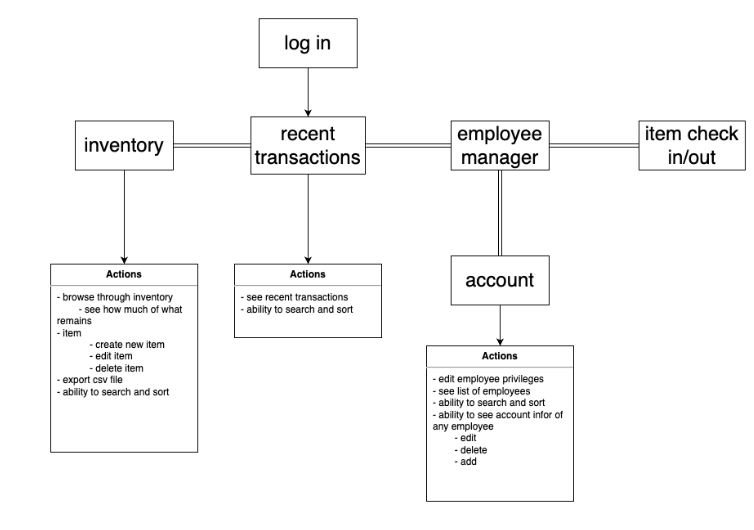

# Inventory tracking app

## Table of Contents

- [Inventory tracking app](#inventory-tracking-app)
  - [Table of Contents](#table-of-contents)
    - [Synopsis](#synopsis)
    - [Installation](#installation)
    - [Testing](#testing)
    - [Deployment](#deployment)
    - [Project Timeline](#project-timeline)
    - [Project Flow Diagram](#project-flow-diagram)
    - [Developer Contact Information](#developer-contact-information)

---

### Synopsis

- Our Client:
  - San Mateo County Mosquito and Vector Control District
- Our Client’s business:
  - The San Mateo County Mosquito and Vector Control District actively reduces vector populations of disease-carrying pests, employing a science-based approach of integrated vector management. In addition, the district is engaged in ongoing research and development initiatives to enhance its capabilities in safeguarding public health
- Our Client’s “problem” to be solved:
  - The client currently manages inventory using a manual paper-based system, leading to increased workload and extended processing times.
- Our proposed solution:

  - Our team will address the client's current manual inventory management system by introducing an innovative website-based solution. This digital platform will significantly enhance efficiency through electronic inventory management and seamless QR scanning for streamlined item checkouts. By transitioning from a paper-based process to a digital one, we aim to reduce workload and processing times, providing the client with a more effective and time-saving solution.
  - Key solutions:

    - Electronic Inventory Management:
    - Transition from manual paper records to a digital platform.
    - Offers a more organized and efficient method for managing inventory.
    - Enhances the overall control and visibility of the client’s inventory assets.
    - QR Scanning Integration:
    - Expedites the checkout process for a quicker and more user-friendly experience.
    - Enables swift access and updates to inventory information.

  - Our team's solution stands out due to its integration of both electronic inventory management and QR scanning capabilities. This dual functionality provides a comprehensive approach to the client's challenge, ensuring not only a more streamlined inventory control system but also a user-friendly method for item transactions. The combination of these features sets our solution apart, offering a unique and effective approach to solving the client's business problem.

---

### Installation

TBD

---

### Testing

TBD

---

### Deployment

- Prerequisites: install Node.js
- Clone the Repository by using this command: `git clone https://github.com/vstatnyk/Inventory-tracking-app-CSC190-191.git`
- Installing Dependencies:
  - Server
    - In terminal use `cd server`
    - `npm install`
  - Client
    - In terminal use `cd client`
    - `npm install`
- Running the application for development:
  - Server
    - In terminal use `cd server`
    - `npm run dev`
  - Client
    - In terminal use `cd client`
    - `npm run dev`

---

### Project Timeline

The Image below shows our Jira timeline for the project as of the end of sprint 4

---

### Project Flow Diagram

---

### Developer Contact Information

- Cayman Bawden
  - Email: caymanbawden@gmail.com
- Brian Beilby
  - Email: brianbeilby98@gmail.com
- Douglas Camero
  - Email: realcamero@gmail.com
- Bohdan Hrytsak
  - Email: bhrytsak@gmail.com
- Shafii Mohammed
  - Email: shafii5703@gmail.com
- Matthew Ryan
  - Email: mryan5072@gmail.com
- Rafael Slivca
  - Email: rslivca@outlook.com
- Vlad Statnyk
  - Email: vlad.statnyk@gmail.com
